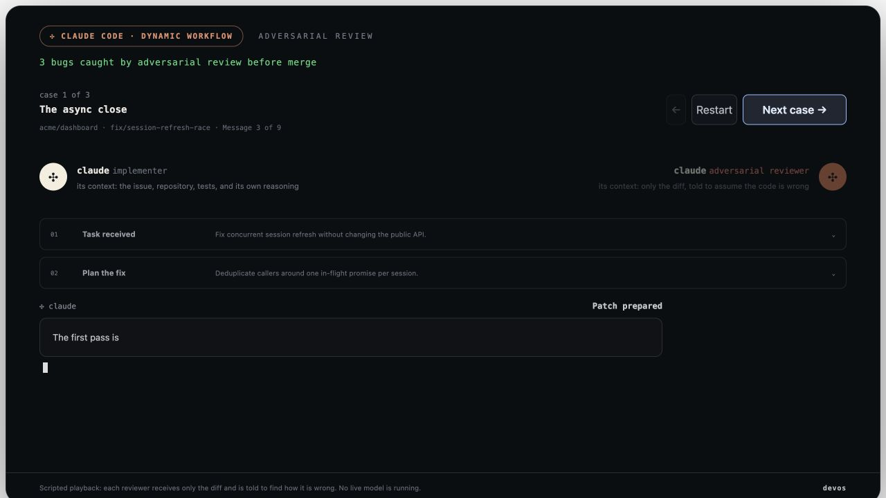

# Agent Session Replayer

An SSR-safe React component for replaying a fixed, scripted implementer/reviewer workflow. It renders only the replay data you supply: it does not run a model, execute tools, or modify a repository.

The complete package guide, including callback ordering, theming, SSR, reduced motion, accessibility, and error examples, is in [the package README](packages/agent-session-replayer/README.md).



## Install and run

```bash
bun install
bun run dev
```

To consume the published workspace package:

```tsx
import { AgentSessionReplayer, type AgentSession, type AgentSessionReplayerProps } from "agent-session-replayer";
import "agent-session-replayer/styles.css";
```

## Minimal replay

```tsx
const agents: AgentSessionReplayerProps["agents"] = {
  implementer: { id: "impl", name: "Claude", role: "Implementer", context: "the repository" },
  reviewer: { id: "review", name: "Reviewer", role: "Adversarial reviewer", context: "the diff" },
};

const cases: AgentSession[] = [{
  id: "checkout-fix",
  title: "Fix checkout total",
  summary: "A deterministic implementation and review replay.",
  repository: "acme/storefront",
  branch: "fix/checkout-total",
  events: [{
    id: "task",
    type: "task_received",
    actor: "implementer",
    title: "Read the task",
    summary: "Confirm the requested behavior.",
    blocks: [{ id: "request", kind: "message", content: "Correct the total." }],
  }],
}];

<AgentSessionReplayer agents={agents} cases={cases} />;
```

## Props

Every object is validated strictly at runtime. Required strings are non-empty, arrays have the minimum items described below, and unknown keys are rejected.

| Prop | Required / default | Contract |
| --- | --- | --- |
| `agents` | Required | Exactly `implementer` and `reviewer` `AgentIdentity` objects. |
| `cases` | Required | Non-empty `AgentSession[]`; case IDs are globally unique. |
| `typingSpeed` | `110` | Finite positive number of graphemes per second. |
| `eventDelayMs` | `500` | Finite non-negative delay in milliseconds. |
| `height` | `720` | Finite positive pixel height. |
| `colors` | Optional | Strict `AgentSessionColors` CSS-variable overrides. |
| `caseIndex` | Optional | Controlled integer index within `cases`. |
| `initialCaseIndex` | `0` | Uncontrolled integer start index within `cases`. |
| `className` | Optional | Root-element class name. |
| `onCaseChange` | Optional | `(index, item) => void` for user navigation requests. |
| `onEventStart` | Optional | `(event, item) => void` before reveal begins. |
| `onEventComplete` | Optional | `(event, item) => void` after reveal finishes. |
| `onCaseComplete` | Optional | `(item) => void` after the final event completes. |

Omit `caseIndex` for uncontrolled navigation. When it is supplied, update it in `onCaseChange`:

```tsx
import { useState } from "react";

const [caseIndex, setCaseIndex] = useState(0);
<AgentSessionReplayer
  agents={agents}
  cases={cases}
  caseIndex={caseIndex}
  onCaseChange={(nextIndex) => setCaseIndex(nextIndex)}
/>;
```

## Replay-data schema

| Object | Required fields and constraints |
| --- | --- |
| `AgentIdentity` | `id`, `name`, `role`, `context`: non-empty strings. |
| `AgentSession` | `id`, `title`, `summary`, `repository`, `branch`: non-empty strings; `events`: non-empty array with unique event IDs. |
| `AgentSessionEvent` | `id`, `title`, `summary`: non-empty strings; `type`, `actor`; non-empty `blocks` array with unique block IDs. |
| `AgentSessionBlock` | `id`, `kind`, `content`; optional non-empty `title` and `language`. |

Event `type` values:

```ts
"task_received" | "plan" | "patch" | "review_request" | "review_start"
| "blocking_finding" | "revision" | "verification" | "approval"
```

Block `kind` values:

```ts
"message" | "code" | "tool_call" | "tool_output" | "finding" | "patch"
| "git_diff" | "status" | "result"
```

## Runtime validation

Validation is internal to the component; no schema or parser is added to the public API. Invalid props throw before playback with an error prefixed by `AgentSessionReplayer received invalid props:` and include paths such as `cases[0].events[0].blocks[0].content`.

## Repository commands

```bash
bun test
bun run typecheck
bun run build:package
bun run build
```
